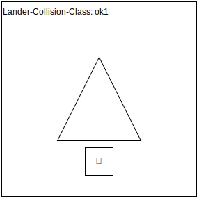
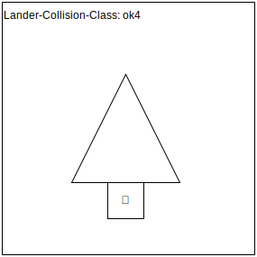
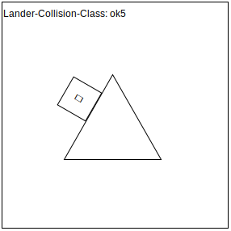
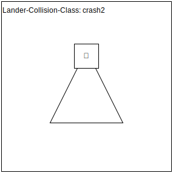
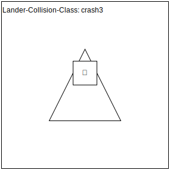
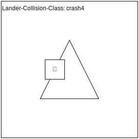

# Übungsblatt 00

|   |            |
|---|------------|
| Abgabe von: | **Jonas Merkle** [[jonas.merkle@uni-ulm.de](mailto:jonas.merkle@un-ulm.de?subject=%C3%9Cbung%20Angewandte%20Stochastik)] |
| Abgabe bis: | XX.XX.2024 10:15 |
| Repository: | [https://github.com/jonas-merkle/Softwarequalitaetssicherung](https://github.com/jonas-merkle/Softwarequalitaetssicherung) |
| Dateien:    | [PDF](https://jonas-merkle.github.io/Softwarequalitaetssicherung/Uebungsblatt00/Uebungsblatt00_Jonas-Merkle.pdf), [ZIP](https://jonas-merkle.github.io/Softwarequalitaetssicherung/Uebungsblatt00/Uebungsblatt00_Jonas-Merkle.zip), [HTML](https://jonas-merkle.github.io/Softwarequalitaetssicherung/Uebungsblatt00/Uebungsblatt00_Jonas-Merkle.html) |

## Inhaltsverzeichnis

- [Übungsblatt 00](#übungsblatt-00)
  - [Inhaltsverzeichnis](#inhaltsverzeichnis)
  - [Aufgabe 1](#aufgabe-1)
    - [Aufgabe 1a](#aufgabe-1a)
    - [Aufgabe 1b](#aufgabe-1b)

## Aufgabe 1

### Aufgabe 1a

(Black-Box) Unit-Tests der Stufenweise Schubkontrolle im GameModel.

Die Implementierung der Tests ist in der folgenden Datei zu finden: [./src/LunarLander_Tests/src/LunarLander/GameModelTest.java](./src/LunarLander_Tests/src/LunarLander/GameModelTest.java)

### Aufgabe 1b

(Black-Box) Unit-Tests Kollisionserkennung mit Hindernissen.

Skizzen der getesteten Äquivalenzklassen:

Erlaubte Konstellationen:

Nicht erlaubte Konstellationen:

Die Implementierung der Tests ist in der folgenden Datei zu finden: [./src/LunarLander_Tests/src/LunarLander/GameModelTest.java](./src/LunarLander_Tests/src/LunarLander/GameModelTest.java)
